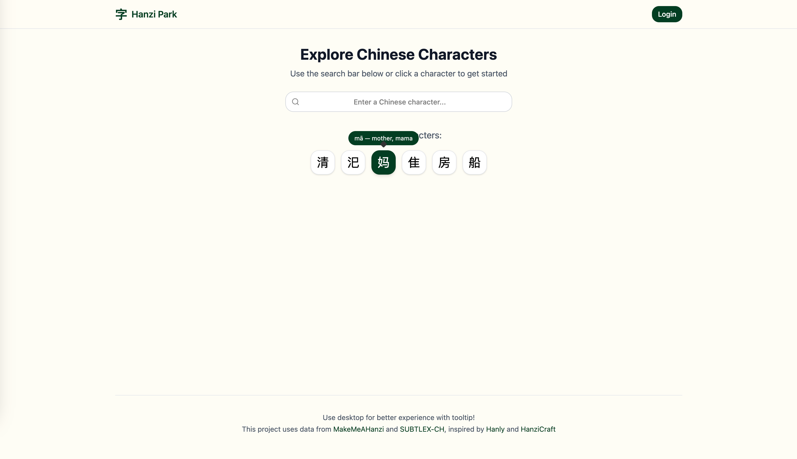
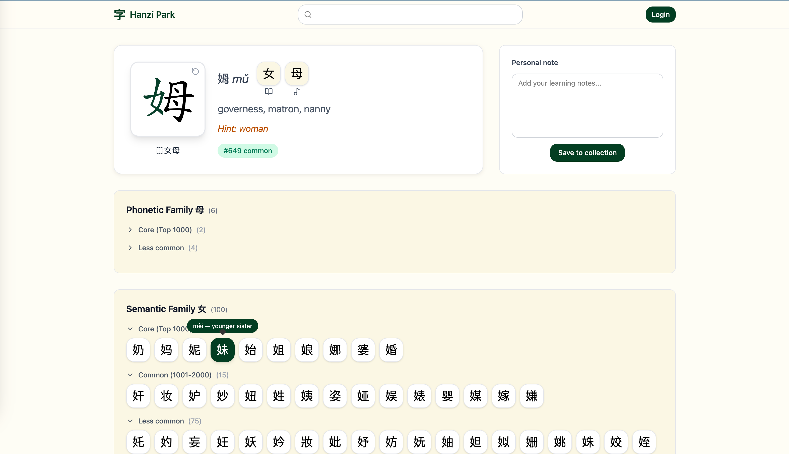
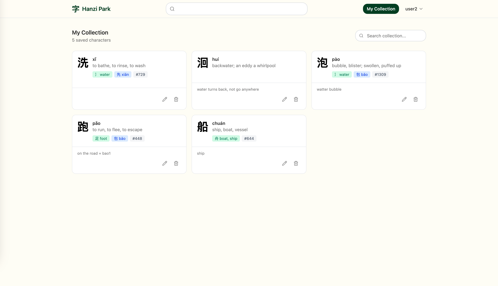

# 字 Hanzi Park

A Chinese character exploration tool that helps learners explore, understand, and memorize Hanzi through component analysis, stroke order animations, and side-by-side comparison of similar characters. The app highlights semantic and phonetic components while displaying related characters together with their pinyin and meanings in tooltips to help learners recognize patterns, spot differences, and form stronger mental connections.

## Features

- **Character Lookup** — Search a Chinese character and get detailed information including pinyin, definitions, decomposition, etymology, hints and frequency rank
- **Stroke Order Animation** — Watch animated stroke order using [HanziWriter](https://hanziwriter.org/)
- **Component Analysis** — See how characters decompose into semantic and phonetic components
- **Character Families** — Discover related characters sharing the same phonetic or semantic components
- **Personal Notes** — Save characters to your collection with custom notes
- And more to come!

<div align="center">
  
  <p><em>Home page interface </em></p>

  
  <p><em>Character details page interface </em></p>

  
  <p><em>Collection page interface </em></p>

</div>

## Tech Stack

**Frontend**

- React 19 + TypeScript
- Vite
- TailwindCSS 4
- TanStack Query (React Query)
- Zustand (state management)
- React Hook Form + Zod
- shadcn/ui components

**Backend**

- Node.js + Express 5
- MongoDB + Mongoose
- JWT authentication with refresh tokens

**Deployment**

- Vercel (frontend + serverless API)

## Project Structure

```
hanzi-park/
├── frontend/                # React frontend application
│   ├── src/
│   │   ├── components/      # Shared UI components
│   │   ├── features/        # Feature-based modules
│   │   │   ├── auth/        # Authentication
│   │   │   ├── character/   # Character lookup & display
│   │   │   └── note/        # User notes/collection
│   │   ├── lib/             # Utilities (axios, toast, etc.)
│   │   └── pages/           # Route pages
│   └── ...
├── backend/                 # Express API server
│   └── src/
│       ├── controllers/     # Route handlers
│       ├── models/          # Mongoose schemas
│       ├── repositories/    # Data access layer
│       ├── services/        # Business logic
│       ├── routes/          # API routes
│       └── scripts/         # Database seeding scripts
├── api/                     # Vercel serverless entry point
└── vercel.json              # Vercel deployment config
```

## Getting Started

### Prerequisites

- Node.js 18+
- MongoDB instance (local or Atlas)
- npm or yarn

### Installation

1. **Clone the repository**

   ```bash
   git clone https://github.com/yourusername/hanzi-park.git
   cd hanzi-park
   ```

2. **Install dependencies**

   ```bash
   npm run install:all
   ```

3. **Set up environment variables**

   Create `backend/.env`:

   ```env
   MONGODB_CONNECTION=your_mongodb_connection_string
   ACCESS_TOKEN_SECRET=your_jwt_secret
   CLIENT_URL=http://localhost:5173
   PORT=5001
   ```

4. **Seed the database**

   Download the dictionary data file (`dictionary.txt` from [MakeMeAHanzi](https://github.com/skishore/makemeahanzi)) and place it in `backend/data/`.

   Optionally download `SUBTLEX-CH-CHR.xlsx` for frequency data.

   ```bash
   cd backend
   npm run seed:dictionary
   ```

5. **Start development servers**

   ```bash
   # From root directory
   npm run dev
   ```

   This runs both frontend (http://localhost:5173) and backend (http://localhost:5001) concurrently.

## Data Sources

- **Character Data**: [MakeMeAHanzi](https://github.com/skishore/makemeahanzi) — Includes decomposition, etymology, and stroke data
- **Frequency Data**: [SUBTLEX-CH](https://www.ugent.be/pp/experimentele-psychologie/en/research/documents/subtlexch) — Character frequency based on film subtitles
